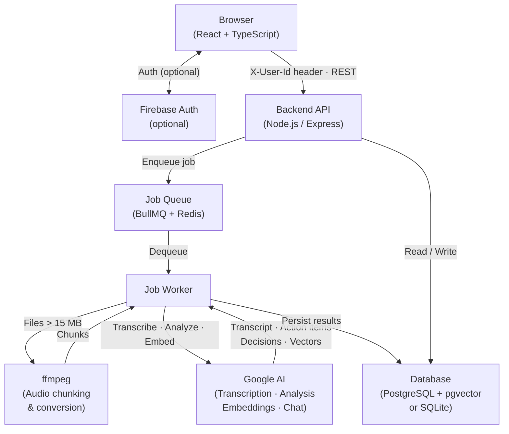
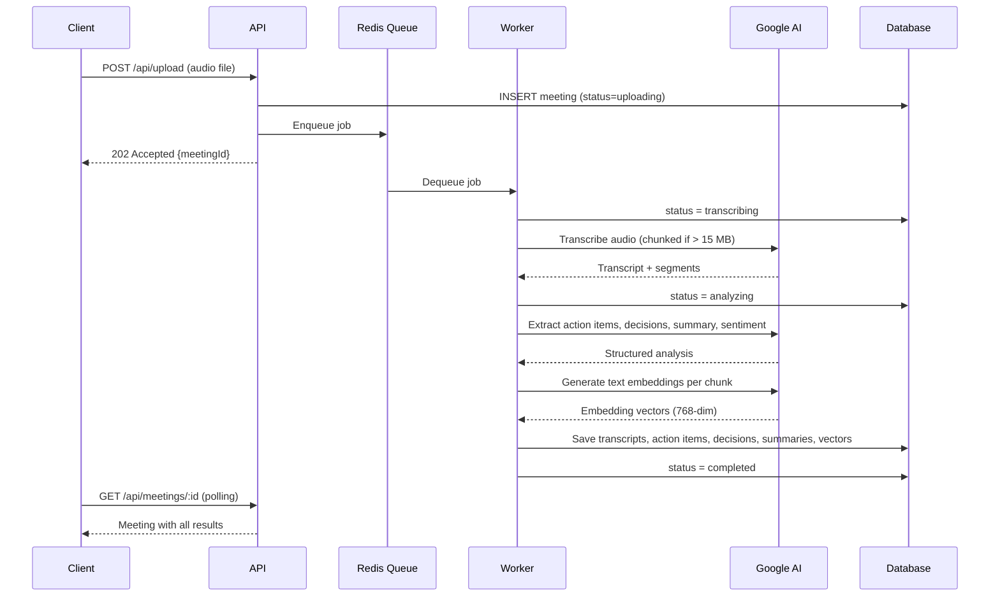

# MeetingMind

AI-powered meeting intelligence platform. Upload or record meetings and get automatic transcription, speaker identification, action item extraction, sentiment analysis, and smart summaries — backed by Node.js/PostgreSQL stack.


---

## Features

### Core Pipeline
- **Audio Upload & In-Browser Recording** — upload MP3, MP4, WAV, M4A, WebM; or record directly via the browser microphone
- **AI Transcription** — speaker-diarized transcripts with timestamps and confidence scores; files over 15 MB are automatically split into chunks via ffmpeg, transcribed in segments, and stitched back together with correct time offsets
- **Speaker Diarization** — each transcript segment labelled by speaker; speakers can be renamed and assigned roles/colors
- **Smart Summaries** — short, medium, and full AI-generated summaries per meeting
- **Action Item Extraction** — AI extracts tasks with assignee, due date, and priority from the transcript
- **Key Decisions** — AI identifies and saves decisions made during the meeting
- **Sentiment Analysis** — per-meeting overall sentiment and per-speaker sentiment breakdown

### Search & Analysis
- **Semantic Search** — pgvector HNSW index with cosine similarity (`<=>` operator) using high-dimensional text embeddings; falls back to full-text search when running on SQLite
- **AI Chat** — ask freeform questions about any meeting; AI answers from the transcript
- **Meeting Health Score** — scores participation balance, duration efficiency, action item density, sentiment, and completion rate
- **Meeting Comparison** — side-by-side AI comparison of two meetings
- **Analytics Dashboard** — weekly trends, time in meetings, action item completion rates, sentiment over time

### Productivity
- **Action Items Dashboard** — Kanban board across all meetings; drag to change status
- **Highlights & Comments** — annotate and bookmark transcript moments
- **Tags, Categories, Agenda** — organize meetings and attach agenda text before uploading
- **Templates** — save and reuse meeting configurations
- **Markdown Export** — export complete meeting notes as `.md`
- **Notifications** — real-time alerts for processing completion and overdue action items

### App
- **Authentication** — Firebase Auth (Google sign-in + email/password) with a localStorage mock fallback when Firebase is not configured; guest mode available
- **Dark Mode** — persisted across sessions
- **Keyboard Shortcuts** — full keyboard navigation
- **Achievement System** — milestones driven by real analytics data (meetings recorded, actions completed, decisions documented)
- **Privacy Controls** — configurable redaction patterns for sensitive transcripts
- **Mobile Responsive** — works on small screens

---

## Tech Stack

### Frontend
| Layer | Technology |
|-------|-----------|
| Framework | React 18 + TypeScript |
| Build | Vite 5 (manual chunk splitting — main bundle 95 KB gzip) |
| UI | shadcn/ui + Tailwind CSS |
| Data Fetching | TanStack Query v5 |
| Routing | React Router v6 |
| Auth | Firebase Auth SDK (optional) |
| Error Tracking | Sentry (optional) |
| Testing | Vitest + Testing Library |

### Backend
| Layer | Technology |
|-------|-----------|
| Runtime | Node.js 20 (ESM) |
| Framework | Express |
| Database | PostgreSQL + pgvector (Docker), SQLite fallback for local dev |
| Vector Search | pgvector HNSW index, 768-dim AI text embeddings |
| Job Queue | BullMQ + Redis (3 retries with exponential backoff) |
| AI | Google AI (transcription, analysis, chat, embeddings) |
| Audio Processing | ffmpeg (format conversion, chunked splitting) |
| Security | Helmet, express-rate-limit (tiered), Zod validation |
| Error Tracking | Sentry (optional) |
| Testing | Vitest (35 tests including retrieval eval) |

---

## Architecture



### Processing pipeline (per meeting)



---

## Project Structure

```
MeetingMind/
├── src/                          # Frontend
│   ├── components/               # UI components (shadcn/ui + custom)
│   ├── pages/                    # Route-level pages
│   ├── contexts/AuthContext.tsx  # Firebase + mock auth, session state
│   └── lib/
│       ├── api.ts                # All API calls (auto-injects X-User-Id header)
│       └── session.ts            # Module-level userId for non-React contexts
│
├── backend/
│   └── src/
│       ├── routes/               # Express handlers (meetings, upload, search, analytics…)
│       ├── services/
│       │   ├── transcription.js  # AI transcription + ffmpeg chunking
│       │   ├── embeddings.js     # AI text embeddings → pgvector storage
│       │   ├── ai-analysis.js    # Action items, decisions, summaries, sentiment
│       │   └── diarization.js    # Speaker diarization
│       ├── middleware/
│       │   ├── auth.js           # requireAuth / extractUser (X-User-Id header)
│       │   └── validate.js       # Zod schema validation
│       ├── models/
│       │   ├── db.js             # Dual PostgreSQL/SQLite query helper + pgvector migration
│       │   └── schema.sql        # Table definitions
│       └── jobs/processor.js     # BullMQ pipeline: transcribe → diarize → analyze → embed
│
├── docker-compose.yml            # PostgreSQL (pgvector) + Redis + backend
├── .env.example                  # Frontend env template
└── backend/.env.example          # Backend env template
```

---

## Getting Started

### Option A — Docker (recommended, full stack)

Requires Docker and Docker Compose.

```bash
git clone https://github.com/SriramAtmakuri/MeetingMind.git
cd MeetingMind

# Configure backend
cp backend/.env.example backend/.env
# Edit backend/.env — set API_KEY

# Start PostgreSQL + Redis + backend
docker compose up -d

# Start frontend
npm install
cp .env.example .env
npm run dev
```

### Option B — Local dev (SQLite, no Docker)

```bash
# 1. Start Redis (required for job queue)
redis-server

# 2. Backend
cd backend
npm install
cp .env.example .env
# Edit backend/.env — set API_KEY; leave DATABASE_URL unset to use SQLite
npm run dev

# 3. Frontend (new terminal, from project root)
npm install
cp .env.example .env
npm run dev
```

> Without `API_KEY`, transcription and AI analysis fall back to mock data — the UI remains fully functional for development.

---

## Environment Variables

### Frontend — `/.env`

| Variable | Required | Description |
|----------|----------|-------------|
| `VITE_API_URL` | Yes | Backend API base URL |
| `VITE_APP_NAME` | No | App display name |
| `VITE_FIREBASE_API_KEY` | No | Firebase project API key (public client identifier — not a secret) |
| `VITE_FIREBASE_AUTH_DOMAIN` | No | Firebase auth domain |
| `VITE_FIREBASE_PROJECT_ID` | No | Firebase project ID |
| `VITE_FIREBASE_STORAGE_BUCKET` | No | Firebase storage bucket |
| `VITE_FIREBASE_MESSAGING_SENDER_ID` | No | Firebase sender ID |
| `VITE_FIREBASE_APP_ID` | No | Firebase app ID |
| `VITE_SENTRY_DSN` | No | Sentry DSN for frontend error tracking |

> `VITE_*` variables are bundled into the browser JS build and are visible to all users. Never put secrets here. All API keys belong in `backend/.env`.

### Backend — `/backend/.env`

| Variable | Required | Description |
|----------|----------|-------------|
| `API_KEY` | Yes* | Google AI API key for transcription, analysis, and embeddings. Falls back to mock data if unset. |
| `REDIS_URL` | Yes | Redis connection URL |
| `DATABASE_URL` | No | PostgreSQL connection string. If unset, SQLite is used automatically. |
| `DATABASE_PATH` | No | SQLite file path (default: `./data/meetingmind.db`) |
| `PORT` | No | Server port (default: `3001`) |
| `FRONTEND_URL` | No | Frontend origin for CORS |
| `UPLOAD_DIR` | No | Directory for uploaded audio files |
| `MAX_FILE_SIZE` | No | Max upload size in bytes (default: 500 MB) |
| `MAX_CONCURRENT_JOBS` | No | BullMQ worker concurrency (default: `2`) |
| `FIREBASE_SERVICE_ACCOUNT_PATH` | No | Path to Firebase service account JSON (cloud file storage only) |
| `FIREBASE_STORAGE_BUCKET` | No | Firebase storage bucket name |
| `SENTRY_DSN` | No | Sentry DSN for backend error tracking |

---

## Architecture Notes

### Authentication
The frontend injects `X-User-Id` on every API request. The backend `requireAuth` middleware rejects requests missing this header with 401. Firebase Auth is optional — when unconfigured, a localStorage-based mock handles sign-in so the app works without any Firebase setup.

### Database modes
`db.js` exports a single `query(sql, params)` function. When `DATABASE_URL` is set it uses a PostgreSQL pool; otherwise it uses SQLite. The SQLite adapter converts `$1/$2` placeholders to `?`, strips `RETURNING` clauses, and emulates UUID generation — so route handlers are written once for both databases.

### Vector search
When running on PostgreSQL, transcript chunks are stored with a 768-dim embedding vector in `vector_chunks.vector_embedding` (`vector(768)` type). An HNSW index (`m=16`, `ef_construction=64`) enables sub-linear approximate nearest-neighbour search. Queries use the `<=>` cosine distance operator. Without PostgreSQL or without an AI API key, search falls back to full-text matching.

### Large file transcription
Files over 15 MB are split by ffmpeg into 10-minute segments. Each segment is transcribed independently, then stitched: timestamps in every chunk are offset by the cumulative duration of prior chunks so the final transcript is globally time-ordered.

### Rate limiting
- Global: 300 requests / 15 min
- Upload endpoint: 20 requests / hour
- AI endpoints: 30 requests / minute

---

## Scripts

### Frontend
```bash
npm run dev        # Start dev server
npm run build      # Production build to dist/
npm test           # Run tests
```

### Backend
```bash
npm run dev        # Start with nodemon (auto-reload)
npm start          # Production server
npm test           # Run tests (35 tests)
```

---

## License

MIT © 2025–2026 Sriram Atmakuri
